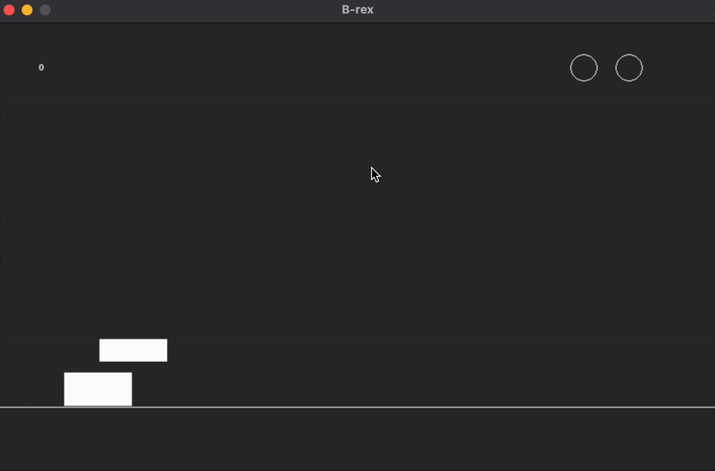

# T-rex game using PyGame

###  The following game is a homage of the google chrome T-rex game. Built using PyGame its purpose was to help me understand OOP practices and how classes, methods and varaibles work in a modular envrionemnt

#### How to play:
- SPACEBAR = jump
- DOWN ARROW KEY = crouch
#### OR
- click in the top half of display to jump
- click in the bottom half of display to crouch
